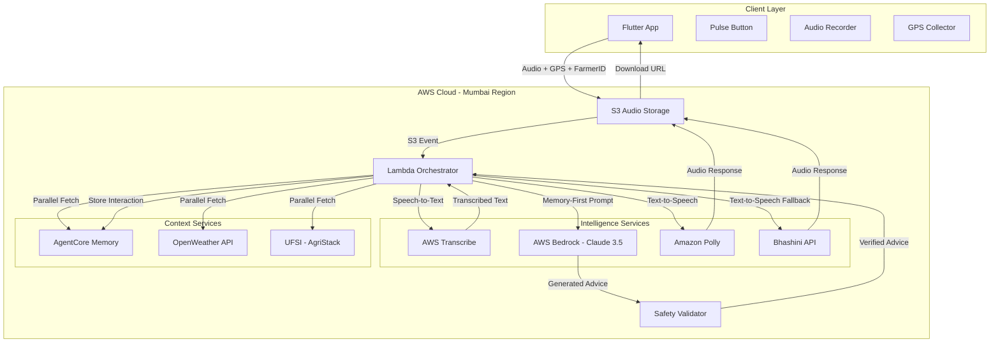

# Design Document: VaniVerse - Proactive Voice-First Layer for Bharat-VISTAAR

## Overview

VaniVerse is a serverless, voice-first AI assistant built on AWS that provides proactive agricultural advice to Indian farmers. The system uses a Lambda-based orchestrator pattern to coordinate speech processing (AWS Transcribe/Polly, Bhashini), AI reasoning (Claude 3.5 Sonnet via Bedrock), contextual data retrieval (OpenWeather, AgriStack/UFSI), and managed conversation memory (AgentCore Memory).

The key innovation is the "Memory-First Prompting" strategy combined with Chain-of-Verification, which ensures the system acts as a concerned mentor rather than a reactive chatbot. By automatically consolidating conversation history and cross-referencing advice with real-time environmental data, VaniVerse provides hyper-local, safety-validated recommendations.

### Design Goals

1. **Voice-First Accessibility**: Enable farmers with limited digital literacy to access expert advice through natural speech in regional dialects
2. **Proactive Engagement**: Check on previous crop issues before answering new questions, creating continuity in farm management
3. **Contextual Grounding**: Validate all advice against real-time weather and land records to ensure relevance
4. **Safety Validation**: Prevent harmful actions through Chain-of-Verification that checks advice against environmental conditions
5. **Simplified Architecture**: Leverage managed services (AgentCore Memory, Bedrock, Transcribe/Polly) to minimize custom logic
6. **Sub-6-Second Latency**: Complete the voice-to-voice loop within 6 seconds through parallel API calls and efficient orchestration

## Architecture

### High-Level Components



### Component Responsibilities

#### Client Layer (Flutter App)
- **Pulse Button**: Single-button interface for voice activation
- **Audio Recorder**: Captures farmer speech with visual/audio feedback
- **GPS Collector**: Retrieves current location coordinates
- **Offline Cache**: Stores last 10 common Q&A pairs for offline mode
- **Audio Player**: Plays synthesized voice responses

#### Lambda Orchestrator
- **Event Handler**: Triggered by S3 audio upload events
- **Parallel Context Retrieval**: Fetches weather, land records, and memory simultaneously
- **Multi-Agent Coordinator**: Manages specialized agents (Weather Analytics, ICAR Knowledge)
- **Prompt Constructor**: Builds Memory-First prompts combining agent outputs for Claude
- **Chain-of-Verification Coordinator**: Invokes safety validation before response delivery
- **Memory Manager**: Passes interactions to AgentCore Memory for automatic storage
- **Bandwidth Detector**: Monitors network conditions and activates low-bandwidth mode when needed

#### Weather Analytics Agent
- **Environmental Risk Assessment**: Analyzes weather data for agricultural activity risks
- **Forecast Interpretation**: Translates weather forecasts into farmer-friendly insights
- **Timing Recommendations**: Suggests optimal timing for weather-sensitive operations
- **Specialized Focus**: Dedicated to weather-related analysis for improved accuracy

#### ICAR Knowledge Agent
- **Crop-Specific Guidance**: Retrieves relevant ICAR best practices for farmer's crop
- **Growth Stage Matching**: Finds advice appropriate to current crop growth stage
- **Practice Recommendations**: Provides evidence-based agricultural techniques
- **Specialized Focus**: Dedicated to agricultural knowledge retrieval for improved accuracy

#### AWS Transcribe
- **Multi-Dialect Recognition**: Supports Hindi, Tamil, Telugu, Kannada, Marathi, Bengali, Gujarati, Punjabi
- **Language Detection**: Automatically identifies spoken language
- **Confidence Scoring**: Returns confidence levels for quality control

#### AWS Bedrock (Claude 3.5 Sonnet)
- **Agricultural Reasoning**: Generates contextually-grounded advice using ICAR knowledge
- **Memory-First Logic**: Prioritizes follow-up questions about unresolved issues
- **Multi-Option Presentation**: Explains trade-offs when multiple approaches exist

#### Amazon Polly / Bhashini
- **Neural Voice Synthesis**: Converts advice text to natural-sounding speech
- **Language Routing**: Uses Polly for supported languages, Bhashini for others
- **Regional Voice Selection**: Matches voice to farmer's detected language

#### AgentCore Memory
- **Automatic Storage**: Stores all interactions without custom logic
- **Short-Term Context**: Maintains session-level conversation flow
- **Long-Term Consolidation**: Extracts patterns and unresolved issues across conversations
- **FarmerID Partitioning**: Isolates memory by farmer for personalization

#### OpenWeather API
- **Current Conditions**: Temperature, humidity, wind speed, precipitation
- **6-Hour Forecast**: Precipitation probability and timing for safety validation
- **Location-Based**: Uses GPS coordinates from Flutter app

#### UFSI (AgriStack)
- **Farmer Identity**: Validates AgriStack IDs
- **Land Records**: Retrieves soil type, land area, crop history
- **OAuth 2.0**: Implements consent-based data access
- **Mock Layer**: Provides sample data for development/testing

#### Safety Validator
- **Weather Conflict Detection**: Checks if advice conflicts with forecast
- **Threshold Enforcement**: Blocks actions during extreme conditions
- **Alternative Recommendations**: Suggests better timing when conditions are unsuitable

## Data Models

### FarmerSession
```typescript
interface FarmerSession {
  farmerId: string;              // Unique identifier (linked to AgriStack ID if available)
  agriStackId?: string;          // Optional AgriStack ID
  sessionId: string;             // Current session identifier
  language: string;              // Detected language code (e.g., "hi-IN", "ta-IN")
  gpsCoordinates: {
    latitude: number;
    longitude: number;
  };
  timestamp: string;             // ISO 8601 timestamp
}
```

### AudioRequest
```typescript
interface AudioRequest {
  audioFileKey: string;          // S3 key for uploaded audio
  farmerId: string;
  sessionId: string;
  gpsCoordinates: {
    latitude: number;
    longitude: number;
  };
  timestamp: string;
}
```

### ContextData
```typescript
interface ContextData {
  weather: WeatherData;
  landRecords?: LandRecords;     // Optional, only if AgriStack ID available
  memory: MemoryContext;
}

interface WeatherData {
  current: {
    temperature: number;         // Celsius
    humidity: number;            // Percentage
    windSpeed: number;           // km/h
    precipitation: number;       // mm
  };
  forecast6h: {
    precipitationProbability: number;  // Percentage
    expectedRainfall: number;          // mm
    temperature: number;
    windSpeed: number;
  };
  timestamp: string;
}

interface LandRecords {
  landArea: number;              // Hectares
  soilType: string;              // e.g., "Clay Loam", "Sandy"
  currentCrop?: string;
  cropHistory: Array<{
    crop: string;
    season: string;
    year: number;
  }>;
}

interface MemoryContext {
  recentInteractions: Array<{
    question: string;
    advice: string;
    timestamp: string;
  }>;
  unresolvedIssues: Array<{
    issue: string;
    crop: string;
    reportedDate: string;
    daysSinceReport: number;
  }>;
  consolidatedInsights: {
    primaryCrop: string;
    commonConcerns: string[];
    farmerName?: string;
  };
}
```

### MemoryFirstPrompt
```typescript
interface MemoryFirstPrompt {
  systemPrompt: string;          // ICAR knowledge + Memory-First instructions
  context: {
    weather: WeatherData;
    landRecords?: LandRecords;
    memory: MemoryContext;
  };
  currentQuestion: string;       // Transcribed farmer question
}
```

### SafetyValidationResult
```typescript
interface SafetyValidationResult {
  isApproved: boolean;
  conflicts: Array<{
    type: string;                // e.g., "rain_forecast", "extreme_temperature"
    severity: "warning" | "blocking";
    message: string;
  }>;
  alternativeRecommendation?: string;
}
```

### VoiceResponse
```typescript
interface VoiceResponse {
  adviceText: string;
  audioFileKey: string;          // S3 key for synthesized audio
  language: string;
  synthesisService: "polly" | "bhashini";
  validationResult: SafetyValidationResult;
  timestamp: string;
}
```

## Components and Interfaces

### 1. Flutter Client App

#### Responsibilities
- Capture voice input via Pulse Button
- Collect GPS coordinates
- Upload audio to S3 with metadata
- Download and play voice responses
- Handle offline mode with cached responses

#### Key Interfaces

```typescript
// Client-side TypeScript/Dart equivalent
class VoiceInteractionService {
  async startRecording(): Promise<void>;
  async stopRecording(): Promise<AudioBlob>;
  async uploadAudio(audio: AudioBlob, metadata: SessionMetadata): Promise<string>;
  async pollForResponse(requestId: string): Promise<VoiceResponse>;
  async playAudio(audioUrl: string): Promise<void>;
}

class OfflineCache {
  async getCachedResponse(questionHash: string): Promise<string | null>;
  async cacheResponse(questionHash: string, response: string): Promise<void>;
  async syncPendingRequests(): Promise<void>;
}
```

### 2. Lambda Orchestrator

#### Responsibilities
- Handle S3 upload events
- Coordinate parallel API calls
- Construct Memory-First prompts
- Invoke Chain-of-Verification
- Manage response synthesis

#### Key Functions

```python
# Lambda handler (Python)
def lambda_handler(event, context):
    """
    Main orchestrator triggered by S3 upload event.
    Coordinates specialized agents for improved accuracy.
    """
    # Extract audio metadata from S3 event
    audio_request = parse_s3_event(event)
    
    # Check bandwidth and activate low-bandwidth mode if needed
    bandwidth_mode = detect_bandwidth_mode(audio_request)
    
    # Step 1: Transcribe audio (with compression if low-bandwidth)
    transcribed_text = transcribe_audio(
        audio_request.audioFileKey, 
        audio_request.language,
        low_bandwidth=bandwidth_mode == 'low'
    )
    
    # Step 2: Parallel context retrieval
    context_data = fetch_context_parallel(
        farmer_id=audio_request.farmerId,
        gps=audio_request.gpsCoordinates
    )
    
    # Step 3: Invoke specialized agents in parallel
    with ThreadPoolExecutor(max_workers=2) as executor:
        weather_analysis_future = executor.submit(
            invoke_weather_analytics_agent,
            context_data.weather,
            transcribed_text
        )
        icar_knowledge_future = executor.submit(
            invoke_icar_knowledge_agent,
            context_data.landRecords,
            context_data.memory,
            transcribed_text
        )
        
        weather_analysis = weather_analysis_future.result()
        icar_knowledge = icar_knowledge_future.result()
    
    # Step 4: Construct Memory-First prompt with agent outputs
    prompt = build_memory_first_prompt(
        transcribed_text, 
        context_data,
        weather_analysis,
        icar_knowledge
    )
    
    # Step 5: Invoke Claude via Bedrock
    advice_text = invoke_bedrock(prompt)
    
    # Step 6: Chain-of-Verification
    validation_result = validate_safety(advice_text, context_data.weather)
    
    if not validation_result.isApproved:
        advice_text = validation_result.alternativeRecommendation
    
    # Step 7: Synthesize speech (with quality adjustment if low-bandwidth)
    audio_key = synthesize_speech(
        advice_text, 
        audio_request.language,
        low_bandwidth=bandwidth_mode == 'low'
    )
    
    # Step 8: Store interaction in AgentCore Memory
    store_interaction(audio_request.farmerId, transcribed_text, advice_text, context_data)
    
    # Step 9: Check if voice loop exceeded timeout, offer USSD fallback
    if bandwidth_mode == 'low' and execution_time > 15:
        return {
            'statusCode': 200,
            'audioKey': audio_key,
            'validationResult': validation_result,
            'ussdFallback': generate_ussd_fallback(advice_text)
        }
    
    return {
        'statusCode': 200,
        'audioKey': audio_key,
        'validationResult': validation_result
    }

def fetch_context_parallel(farmer_id: str, gps: dict) -> ContextData:
    """
    Fetch weather, land records, and memory in parallel.
    """
    with ThreadPoolExecutor(max_workers=3) as executor:
        weather_future = executor.submit(fetch_weather, gps)
        land_future = executor.submit(fetch_land_records, farmer_id)
        memory_future = executor.submit(fetch_memory, farmer_id)
        
        return ContextData(
            weather=weather_future.result(),
            landRecords=land_future.result(),
            memory=memory_future.result()
        )
```

### 3. Speech Processing Module

#### AWS Transcribe Integration

```python
def transcribe_audio(audio_key: str, language_hint: str = None) -> str:
    """
    Transcribe audio using AWS Transcribe with language detection.
    """
    transcribe_client = boto3.client('transcribe')
    
    job_name = f"transcribe-{uuid.uuid4()}"
    audio_uri = f"s3://{AUDIO_BUCKET}/{audio_key}"
    
    # Start transcription job
    transcribe_client.start_transcription_job(
        TranscriptionJobName=job_name,
        Media={'MediaFileUri': audio_uri},
        MediaFormat='wav',
        LanguageCode=language_hint or 'hi-IN',  # Default to Hindi
        Settings={
            'ShowSpeakerLabels': False,
            'MaxSpeakerLabels': 1
        }
    )
    
    # Wait for completion (with timeout)
    waiter = transcribe_client.get_waiter('transcription_job_completed')
    waiter.wait(TranscriptionJobName=job_name, WaiterConfig={'Delay': 5, 'MaxAttempts': 20})
    
    # Get results
    result = transcribe_client.get_transcription_job(TranscriptionJobName=job_name)
    transcript_uri = result['TranscriptionJob']['Transcript']['TranscriptFileUri']
    
    # Download and parse transcript
    transcript_data = requests.get(transcript_uri).json()
    return transcript_data['results']['transcripts'][0]['transcript']
```

#### Amazon Polly / Bhashini Integration

```python
def synthesize_speech(text: str, language: str) -> str:
    """
    Synthesize speech using Polly or Bhashini based on language support.
    """
    # Language routing logic
    polly_supported = ['hi-IN', 'ta-IN', 'te-IN', 'kn-IN', 'ml-IN']
    
    if language in polly_supported:
        return synthesize_with_polly(text, language)
    else:
        return synthesize_with_bhashini(text, language)

def synthesize_with_polly(text: str, language: str) -> str:
    """
    Use Amazon Polly for neural voice synthesis.
    """
    polly_client = boto3.client('polly')
    
    voice_map = {
        'hi-IN': 'Aditi',
        'ta-IN': 'Kajal',
        'te-IN': 'Kajal',  # Fallback
        'kn-IN': 'Kajal',  # Fallback
    }
    
    response = polly_client.synthesize_speech(
        Text=text,
        OutputFormat='mp3',
        VoiceId=voice_map.get(language, 'Aditi'),
        Engine='neural',
        LanguageCode=language
    )
    
    # Upload to S3
    audio_key = f"responses/{uuid.uuid4()}.mp3"
    s3_client = boto3.client('s3')
    s3_client.upload_fileobj(response['AudioStream'], AUDIO_BUCKET, audio_key)
    
    return audio_key

def synthesize_with_bhashini(text: str, language: str) -> str:
    """
    Use Bhashini API for languages not supported by Polly.
    """
    bhashini_endpoint = os.environ['BHASHINI_TTS_ENDPOINT']
    api_key = os.environ['BHASHINI_API_KEY']
    
    response = requests.post(
        bhashini_endpoint,
        headers={'Authorization': f'Bearer {api_key}'},
        json={
            'text': text,
            'language': language,
            'gender': 'female',
            'speed': 1.0
        }
    )
    
    # Download audio and upload to S3
    audio_data = response.content
    audio_key = f"responses/{uuid.uuid4()}.mp3"
    
    s3_client = boto3.client('s3')
    s3_client.put_object(Bucket=AUDIO_BUCKET, Key=audio_key, Body=audio_data)
    
    return audio_key
```

### 4. Context Retrieval Module

#### OpenWeather API Integration

```python
def fetch_weather(gps: dict) -> WeatherData:
    """
    Fetch current weather and 6-hour forecast from OpenWeather API.
    """
    api_key = os.environ['OPENWEATHER_API_KEY']
    lat, lon = gps['latitude'], gps['longitude']
    
    # Current weather
    current_url = f"https://api.openweathermap.org/data/2.5/weather?lat={lat}&lon={lon}&appid={api_key}&units=metric"
    current_data = requests.get(current_url).json()
    
    # 6-hour forecast
    forecast_url = f"https://api.openweathermap.org/data/2.5/forecast?lat={lat}&lon={lon}&appid={api_key}&units=metric&cnt=2"
    forecast_data = requests.get(forecast_url).json()
    
    return WeatherData(
        current={
            'temperature': current_data['main']['temp'],
            'humidity': current_data['main']['humidity'],
            'windSpeed': current_data['wind']['speed'] * 3.6,  # m/s to km/h
            'precipitation': current_data.get('rain', {}).get('1h', 0)
        },
        forecast6h={
            'precipitationProbability': forecast_data['list'][1]['pop'] * 100,
            'expectedRainfall': forecast_data['list'][1].get('rain', {}).get('3h', 0),
            'temperature': forecast_data['list'][1]['main']['temp'],
            'windSpeed': forecast_data['list'][1]['wind']['speed'] * 3.6
        },
        timestamp=datetime.utcnow().isoformat()
    )
```

#### UFSI (AgriStack) Integration

```python
def fetch_land_records(farmer_id: str) -> LandRecords | None:
    """
    Fetch land records from UFSI API (or mock layer).
    """
    # Check if farmer has linked AgriStack ID
    agristack_id = get_agristack_id(farmer_id)
    if not agristack_id:
        return None
    
    # Use mock layer for development
    if os.environ.get('USE_MOCK_UFSI', 'true') == 'true':
        return fetch_mock_land_records(agristack_id)
    
    # Production UFSI API call
    ufsi_endpoint = os.environ['UFSI_ENDPOINT']
    oauth_token = get_ufsi_oauth_token(farmer_id)
    
    response = requests.get(
        f"{ufsi_endpoint}/land-records/{agristack_id}",
        headers={
            'Authorization': f'Bearer {oauth_token}',
            'X-Request-ID': str(uuid.uuid4())
        }
    )
    
    if response.status_code != 200:
        return None
    
    data = response.json()
    return LandRecords(
        landArea=data['landArea'],
        soilType=data['soilType'],
        currentCrop=data.get('currentCrop'),
        cropHistory=data.get('cropHistory', [])
    )

def fetch_mock_land_records(agristack_id: str) -> LandRecords:
    """
    Mock UFSI layer for development and testing.
    """
    mock_data = {
        'AGRI001': {
            'landArea': 2.5,
            'soilType': 'Clay Loam',
            'currentCrop': 'Rice',
            'cropHistory': [
                {'crop': 'Wheat', 'season': 'Rabi', 'year': 2023},
                {'crop': 'Rice', 'season': 'Kharif', 'year': 2023}
            ]
        }
    }
    
    return LandRecords(**mock_data.get(agristack_id, {
        'landArea': 1.0,
        'soilType': 'Unknown',
        'cropHistory': []
    }))
```

#### AgentCore Memory Integration

```python
def fetch_memory(farmer_id: str) -> MemoryContext:
    """
    Fetch conversation memory from AgentCore Memory.
    """
    bedrock_agent_runtime = boto3.client('bedrock-agent-runtime')
    
    # Query AgentCore Memory for farmer's context
    response = bedrock_agent_runtime.retrieve_and_generate(
        input={
            'text': f"Retrieve conversation history and unresolved issues for farmer {farmer_id}"
        },
        retrieveAndGenerateConfiguration={
            'type': 'KNOWLEDGE_BASE',
            'knowledgeBaseConfiguration': {
                'knowledgeBaseId': os.environ['AGENTCORE_MEMORY_ID'],
                'modelArn': os.environ['CLAUDE_MODEL_ARN']
            }
        },
        sessionId=farmer_id  # Use farmer_id as session identifier
    )
    
    # Parse AgentCore Memory response
    memory_data = parse_agentcore_response(response)
    
    return MemoryContext(
        recentInteractions=memory_data.get('recentInteractions', []),
        unresolvedIssues=memory_data.get('unresolvedIssues', []),
        consolidatedInsights=memory_data.get('consolidatedInsights', {})
    )

def store_interaction(farmer_id: str, question: str, advice: str, context: ContextData):
    """
    Store interaction in AgentCore Memory for automatic consolidation.
    """
    bedrock_agent_runtime = boto3.client('bedrock-agent-runtime')
    
    # AgentCore Memory automatically handles extraction and consolidation
    interaction_text = f"""
    Farmer Question: {question}
    Advice Given: {advice}
    Weather Context: {context.weather.current}
    Land Context: {context.landRecords}
    Timestamp: {datetime.utcnow().isoformat()}
    """
    
    bedrock_agent_runtime.invoke_agent(
        agentId=os.environ['AGENTCORE_AGENT_ID'],
        agentAliasId=os.environ['AGENTCORE_ALIAS_ID'],
        sessionId=farmer_id,
        inputText=interaction_text
    )
```

### 5. Memory-First Prompting Module

```python
def invoke_weather_analytics_agent(weather: WeatherData, question: str) -> str:
    """
    Specialized agent for weather analysis and risk assessment.
    """
    bedrock_runtime = boto3.client('bedrock-runtime')
    
    system_prompt = """
You are a Weather Analytics Agent specializing in agricultural meteorology.
Your role is to analyze weather data and assess risks for farming activities.

RESPONSIBILITIES:
1. Interpret current weather conditions for agricultural impact
2. Analyze 6-hour forecasts for activity timing
3. Identify risks (rain, extreme heat, high wind, frost)
4. Recommend optimal timing windows for weather-sensitive operations

RESPONSE FORMAT:
- Current Conditions Summary
- Risk Assessment (High/Medium/Low for various activities)
- Timing Recommendations
- Specific Warnings
"""
    
    request_body = {
        'anthropic_version': 'bedrock-2023-05-31',
        'max_tokens': 500,
        'system': system_prompt,
        'messages': [
            {
                'role': 'user',
                'content': f"""
Weather Data:
{json.dumps(weather, indent=2)}

Farmer's Question: {question}

Provide weather analysis and risk assessment.
"""
            }
        ]
    }
    
    response = bedrock_runtime.invoke_model(
        modelId='anthropic.claude-3-5-sonnet-20241022-v2:0',
        body=json.dumps(request_body)
    )
    
    response_body = json.loads(response['body'].read())
    return response_body['content'][0]['text']

def invoke_icar_knowledge_agent(land_records: LandRecords, memory: MemoryContext, question: str) -> str:
    """
    Specialized agent for ICAR agricultural knowledge retrieval.
    """
    bedrock_runtime = boto3.client('bedrock-runtime')
    
    system_prompt = """
You are an ICAR Knowledge Agent specializing in Indian agricultural best practices.
Your role is to retrieve and apply ICAR guidelines to farmer questions.

KNOWLEDGE BASE:
- ICAR crop-specific guidelines
- Soil management practices
- Pest and disease management
- Fertilizer recommendations
- Irrigation best practices
- Organic farming techniques

RESPONSIBILITIES:
1. Match farmer's crop and growth stage to relevant ICAR guidelines
2. Provide evidence-based recommendations
3. Cite specific ICAR publications or guidelines
4. Consider soil type and regional factors

RESPONSE FORMAT:
- Relevant ICAR Guidelines
- Crop-Specific Recommendations
- Growth Stage Considerations
- Source Citations
"""
    
    request_body = {
        'anthropic_version': 'bedrock-2023-05-31',
        'max_tokens': 500,
        'system': system_prompt,
        'messages': [
            {
                'role': 'user',
                'content': f"""
Land Records:
{json.dumps(land_records, indent=2)}

Farmer Context:
{json.dumps(memory.consolidatedInsights, indent=2)}

Farmer's Question: {question}

Provide ICAR-based agricultural guidance.
"""
            }
        ]
    }
    
    response = bedrock_runtime.invoke_model(
        modelId='anthropic.claude-3-5-sonnet-20241022-v2:0',
        body=json.dumps(request_body)
    )
    
    response_body = json.loads(response['body'].read())
    return response_body['content'][0]['text']

def build_memory_first_prompt(
    question: str, 
    context: ContextData,
    weather_analysis: str,
    icar_knowledge: str
) -> MemoryFirstPrompt:
    """
    Construct Memory-First prompt combining specialized agent outputs.
    Includes advice provenance requirements.
    """
    system_prompt = f"""
You are VaniVerse, a proactive agricultural advisor for Indian farmers. You act as a concerned mentor, not just an information provider.

CRITICAL INSTRUCTIONS - FOLLOW IN ORDER:

1. MEMORY-FIRST PRIORITY:
   - Check if there are unresolved issues from previous conversations
   - If yes, ask a follow-up question about those issues BEFORE answering the current question
   - Example: "Before I answer that, how is the leaf curl issue on your tomatoes that you mentioned last week?"

2. SPECIALIZED AGENT INPUTS:
   
   Weather Analysis (from Weather Analytics Agent):
   {weather_analysis}
   
   ICAR Knowledge (from ICAR Knowledge Agent):
   {icar_knowledge}

3. CURRENT CONTEXT:
   Weather: {format_weather(context.weather)}
   Land: {format_land_records(context.landRecords)}
   Recent Interactions: {format_recent_interactions(context.memory.recentInteractions)}
   Unresolved Issues: {format_unresolved_issues(context.memory.unresolvedIssues)}

4. ADVICE PROVENANCE (CRITICAL):
   - ALWAYS explain WHY you're giving specific advice
   - Reference the specific context factors that influenced your recommendation
   - Examples:
     * "Because your soil record shows low nitrogen..."
     * "Since the weather forecast predicts rain in 4 hours..."
     * "Given that you mentioned pest issues last week..."
   - Every recommendation must include at least one provenance statement

5. RESPONSE STYLE:
   - Speak naturally in the farmer's language
   - Use simple, practical terms
   - Provide specific, actionable steps
   - Explain WHY, not just WHAT
   - Build trust through transparency

6. SAFETY:
   - Your advice will be verified against weather conditions
   - If suggesting pesticide application, mention timing considerations
   - If suggesting irrigation, mention temperature and evaporation factors
"""
    
    return MemoryFirstPrompt(
        systemPrompt=system_prompt,
        context=context,
        currentQuestion=question
    )

def invoke_bedrock(prompt: MemoryFirstPrompt) -> str:
    """
    Invoke Claude 3.5 Sonnet via AWS Bedrock.
    """
    bedrock_runtime = boto3.client('bedrock-runtime')
    
    request_body = {
        'anthropic_version': 'bedrock-2023-05-31',
        'max_tokens': 1000,
        'system': prompt.systemPrompt,
        'messages': [
            {
                'role': 'user',
                'content': f"""
Context:
{json.dumps(prompt.context, indent=2)}

Farmer's Question: {prompt.currentQuestion}

Remember: Check for unresolved issues first, then provide contextually-grounded advice.
"""
            }
        ]
    }
    
    response = bedrock_runtime.invoke_model(
        modelId='anthropic.claude-3-5-sonnet-20241022-v2:0',
        body=json.dumps(request_body)
    )
    
    response_body = json.loads(response['body'].read())
    return response_body['content'][0]['text']
```

### 6. Safety Validation Module (Chain-of-Verification)

```python
def validate_safety(advice_text: str, weather: WeatherData) -> SafetyValidationResult:
    """
    Chain-of-Verification: Check if advice conflicts with weather conditions.
    """
    conflicts = []
    
    # Check for pesticide/spray mentions
    spray_keywords = ['spray', 'pesticide', 'insecticide', 'fungicide', 'apply']
    mentions_spraying = any(keyword in advice_text.lower() for keyword in spray_keywords)
    
    if mentions_spraying:
        # Check rain forecast
        if weather.forecast6h['precipitationProbability'] > 40:
            conflicts.append({
                'type': 'rain_forecast',
                'severity': 'blocking',
                'message': f"Rain is predicted within 6 hours ({weather.forecast6h['precipitationProbability']}% probability). Spraying now will waste pesticide."
            })
        
        # Check wind speed
        if weather.current['windSpeed'] > 20:
            conflicts.append({
                'type': 'high_wind',
                'severity': 'warning',
                'message': f"Wind speed is {weather.current['windSpeed']} km/h. Spray drift may affect neighboring fields."
            })
        
        # Check extreme temperature
        if weather.current['temperature'] > 40:
            conflicts.append({
                'type': 'extreme_heat',
                'severity': 'warning',
                'message': f"Temperature is {weather.current['temperature']}°C. Pesticides may evaporate quickly and be less effective."
            })
    
    # Check for irrigation mentions
    irrigation_keywords = ['water', 'irrigate', 'irrigation']
    mentions_irrigation = any(keyword in advice_text.lower() for keyword in irrigation_keywords)
    
    if mentions_irrigation and weather.current['temperature'] > 35:
        conflicts.append({
            'type': 'high_evaporation',
            'severity': 'warning',
            'message': f"Temperature is {weather.current['temperature']}°C. Consider irrigating in early morning or evening to reduce water loss."
        })
    
    # Determine if advice is approved
    blocking_conflicts = [c for c in conflicts if c['severity'] == 'blocking']
    is_approved = len(blocking_conflicts) == 0
    
    # Generate alternative recommendation if blocked
    alternative = None
    if not is_approved:
        alternative = generate_alternative_recommendation(advice_text, conflicts, weather)
    
    return SafetyValidationResult(
        isApproved=is_approved,
        conflicts=conflicts,
        alternativeRecommendation=alternative
    )

def generate_alternative_recommendation(
    original_advice: str,
    conflicts: list,
    weather: WeatherData
) -> str:
    """
    Generate alternative recommendation when original advice is blocked.
    """
    blocking_messages = [c['message'] for c in conflicts if c['severity'] == 'blocking']
    
    # Calculate safe timing
    hours_until_safe = 6  # Default
    if weather.forecast6h['precipitationProbability'] > 40:
        hours_until_safe = 12  # Wait for rain to pass
    
    alternative = f"""
I understand you want to proceed with this action, but I must advise against it right now due to weather conditions:

{' '.join(blocking_messages)}

ALTERNATIVE RECOMMENDATION:
Wait at least {hours_until_safe} hours and check the weather again. The best time would be early morning (6-8 AM) when:
- Wind speeds are typically lower
- Temperature is moderate
- Dew has dried but heat hasn't peaked

I'll remind you to check back in {hours_until_safe} hours. Your crop's health is important, and timing this correctly will make your efforts more effective.
"""
    
    return alternative
```

### 7. Low-Bandwidth Mode Module

```python
def detect_bandwidth_mode(audio_request: AudioRequest) -> str:
    """
    Detect network bandwidth and determine operational mode.
    """
    # Check metadata for client-reported bandwidth
    if 'bandwidth' in audio_request.metadata:
        bandwidth_kbps = audio_request.metadata['bandwidth']
        if bandwidth_kbps < 100:
            return 'low'
    
    # Check audio file size as proxy for bandwidth
    # If farmer uploaded very small file, likely on slow connection
    audio_size = get_s3_object_size(audio_request.audioFileKey)
    if audio_size < 50000:  # Less than 50KB suggests heavy compression
        return 'low'
    
    return 'normal'

def compress_audio_to_64kbps(audio_data: bytes) -> bytes:
    """
    Compress audio to 64 kbps for low-bandwidth mode.
    """
    import subprocess
    import tempfile
    
    # Write input audio to temp file
    with tempfile.NamedTemporaryFile(suffix='.mp3', delete=False) as input_file:
        input_file.write(audio_data)
        input_path = input_file.name
    
    # Compress using ffmpeg
    output_path = input_path.replace('.mp3', '_compressed.mp3')
    subprocess.run([
        'ffmpeg', '-i', input_path,
        '-b:a', '64k',  # 64 kbps bitrate
        '-ar', '22050',  # Lower sample rate
        output_path
    ], check=True)
    
    # Read compressed audio
    with open(output_path, 'rb') as f:
        compressed_data = f.read()
    
    # Cleanup
    os.remove(input_path)
    os.remove(output_path)
    
    return compressed_data

def generate_ussd_fallback(advice_text: str) -> dict:
    """
    Generate USSD/SMS fallback when voice loop times out.
    """
    # Simplify advice to text-only format
    simplified_text = simplify_advice_for_text(advice_text)
    
    # Break into SMS-sized chunks (160 characters)
    chunks = [simplified_text[i:i+160] for i in range(0, len(simplified_text), 160)]
    
    return {
        'type': 'ussd_fallback',
        'chunks': chunks,
        'ussd_menu': {
            '1': 'Get full advice via SMS',
            '2': 'Try voice again',
            '3': 'Talk to human advisor'
        }
    }

def simplify_advice_for_text(advice_text: str) -> str:
    """
    Simplify verbose advice into concise text for SMS/USSD.
    """
    # Use Claude to summarize
    bedrock_runtime = boto3.client('bedrock-runtime')
    
    request_body = {
        'anthropic_version': 'bedrock-2023-05-31',
        'max_tokens': 300,
        'messages': [
            {
                'role': 'user',
                'content': f"""
Simplify this agricultural advice into a concise SMS format (max 300 characters):

{advice_text}

Requirements:
- Keep key action items
- Remove conversational elements
- Use bullet points
- Be direct and actionable
"""
            }
        ]
    }
    
    response = bedrock_runtime.invoke_model(
        modelId='anthropic.claude-3-5-sonnet-20241022-v2:0',
        body=json.dumps(request_body)
    )
    
    response_body = json.loads(response['body'].read())
    return response_body['content'][0]['text']
```


## Correctness Properties

A property is a characteristic or behavior that should hold true across all valid executions of a system—essentially, a formal statement about what the system should do. Properties serve as the bridge between human-readable specifications and machine-verifiable correctness guarantees.

### Property 1: Voice Loop Completion

*For any* valid audio input in a supported language, the system should complete the full cycle of transcription → context retrieval → advice generation → verification → synthesis and return an audio response.

**Validates: Requirements 1.1, 1.2, 1.3**

### Property 2: Memory-First Proactive Engagement

*For any* farmer with unresolved issues in their conversation history, when they ask a new question, the generated advice should include a follow-up question about the unresolved issue before addressing the new query.

**Validates: Requirements 2.2**

### Property 3: Memory Persistence Round-Trip

*For any* interaction (question + advice + context), after storing it in AgentCore Memory and then retrieving memory for that FarmerID, the interaction should appear in the retrieved context.

**Validates: Requirements 2.1, 2.3, 11.7**

### Property 4: Time-Based Proactive Follow-Up

*For any* crop issue reported more than 7 days ago, when the farmer initiates a new session, the system should proactively ask about the status of that issue.

**Validates: Requirements 2.4**

### Property 5: Context Assembly Completeness

*For any* farmer request, the orchestrator should fetch all available context (weather from OpenWeather, land records from UFSI if AgriStack ID exists, memory from AgentCore) before invoking the Advisory Generator.

**Validates: Requirements 3.1, 3.2, 11.4**

### Property 6: Weather Data Freshness

*For any* cached weather data older than 30 minutes, the system should refresh it from OpenWeather API before generating advice.

**Validates: Requirements 3.3**

### Property 7: Contextual Grounding in Advice

*For any* generated advice, the text should contain references to specific weather conditions (temperature, precipitation, wind) or land characteristics (soil type, crop, land area) from the retrieved context.

**Validates: Requirements 3.4**

### Property 8: Chain-of-Verification Execution Order

*For any* advice generated by Claude, the Safety Validator should execute the Chain-of-Verification step before the advice is synthesized into speech.

**Validates: Requirements 4.6, 11.5**

### Property 9: Rain Forecast Safety Blocking

*For any* advice that mentions pesticide/spray application, if the weather forecast shows >40% precipitation probability within 6 hours, the Safety Validator should block the advice and provide an alternative recommendation.

**Validates: Requirements 4.2, 4.7**

### Property 10: Extreme Weather Warnings

*For any* advice about pesticide application, if current weather conditions are extreme (temperature >40°C or <5°C, or wind speed >20 km/h), the Safety Validator should include a warning in the response.

**Validates: Requirements 4.4**

### Property 11: Alternative Recommendations for Blocked Advice

*For any* advice that is blocked by the Safety Validator due to weather conflicts, the system should provide an alternative timing recommendation with specific hours to wait.

**Validates: Requirements 4.5, 4.7**

### Property 12: AgriStack ID Validation

*For any* provided AgriStack ID, the system should validate it against the UFSI API before using it to fetch land records.

**Validates: Requirements 5.2**

### Property 13: FarmerID Partitioning Consistency

*For any* farmer session, all AgentCore Memory operations (store and retrieve) should use the same FarmerID as the partition key.

**Validates: Requirements 5.3**

### Property 14: Personalized Greeting for Returning Farmers

*For any* returning farmer with existing memory, the initial greeting should include their name and reference their primary crop from consolidated insights.

**Validates: Requirements 5.4**

### Property 15: GPS-Only Fallback for Non-AgriStack Farmers

*For any* farmer without an AgriStack ID, the system should generate advice using only GPS-based weather context without attempting to fetch land records.

**Validates: Requirements 5.5**

### Property 16: Pulse Button Interrupt Capability

*For any* active audio playback, pressing the Pulse Button should immediately pause the playback and allow the farmer to provide new input.

**Validates: Requirements 6.3**

### Property 17: State Transition Audio Feedback

*For any* state change in the client app (listening → processing → speaking), an audio cue should be played to provide feedback to the farmer.

**Validates: Requirements 6.4**

### Property 18: Silence Timeout Prompting

*For any* voice activation where no input is detected for 5 seconds, the system should play an example question prompt to guide the farmer.

**Validates: Requirements 6.5**

### Property 19: Multi-Language Support Coverage

*For any* audio input in Hindi, Tamil, Telugu, Kannada, Marathi, Bengali, Gujarati, or Punjabi, the system should successfully transcribe and respond in the same language.

**Validates: Requirements 7.1**

### Property 20: Automatic Language Detection

*For any* first-time user audio input, the system should automatically detect the spoken language and use it for transcription and synthesis without requiring manual selection.

**Validates: Requirements 7.2**

### Property 21: Low-Confidence Language Confirmation

*For any* language detection with confidence below 70%, the system should ask the farmer to confirm their preferred language before proceeding.

**Validates: Requirements 7.3**

### Property 22: Speech Service Routing

*For any* language with Polly neural voice support (Hindi, Tamil, Telugu, Kannada, Malayalam), the system should use Polly for synthesis; for other supported languages, it should use Bhashini.

**Validates: Requirements 7.4, 7.5**

### Property 23: UFSI OAuth Authentication

*For any* UFSI API call, the request should include a valid OAuth 2.0 bearer token and required headers (API key, consent token, request ID).

**Validates: Requirements 8.4**

### Property 24: Voice-Commanded Data Deletion

*For any* farmer who issues a voice command to delete their history, the system should remove their conversation memory from AgentCore Memory and confirm the deletion.

**Validates: Requirements 8.5**

### Property 25: Graceful API Failure Handling

*For any* external API call (OpenWeather, UFSI) that fails, the system should retry up to 3 times with exponential backoff, and if all retries fail, should provide general advice with a disclaimer about missing context.

**Validates: Requirements 3.5, 9.5, 12.5**

### Property 26: Offline Mode Notification

*For any* network connectivity loss detected by the client app, an audio message should inform the farmer that they are in offline mode.

**Validates: Requirements 9.1**

### Property 27: Offline Cache Size Limit

*For any* sequence of Q&A pairs cached locally, the cache should maintain exactly the 10 most recent pairs and evict older entries.

**Validates: Requirements 9.2**

### Property 28: Offline Mode Disclaimer

*For any* advice provided in offline mode, the response should explicitly state that it is not based on current weather data or conversation history.

**Validates: Requirements 9.3**

### Property 29: Reconnection Sync

*For any* cached audio files when connectivity is restored, the client app should upload all cached files to S3 for processing.

**Validates: Requirements 9.4**

### Property 30: Source Citation in Advice

*For any* generated agricultural advice, the text should include at least one citation to ICAR guidelines or other authoritative sources.

**Validates: Requirements 10.2**

### Property 31: Crop Growth Stage Specificity

*For any* farmer with crop growth stage information in memory, the generated advice should reference the specific growth stage when providing recommendations.

**Validates: Requirements 10.3**

### Property 32: Multi-Option Presentation

*For any* agricultural question with multiple valid approaches, the generated advice should present at least two options and explain the trade-offs between them.

**Validates: Requirements 10.4**

### Property 33: S3 Event Lambda Trigger

*For any* audio file uploaded to the designated S3 bucket, an S3 event should trigger the Orchestrator Lambda function within 1 second.

**Validates: Requirements 11.1**

### Property 34: Verified Synthesis Ordering

*For any* advice that passes Chain-of-Verification, speech synthesis should occur; for any advice that fails verification, synthesis should use the alternative recommendation instead.

**Validates: Requirements 11.6**

### Property 35: Mock UFSI Fallback

*For any* UFSI API call when production APIs are unavailable or in development mode, the system should use the mock UFSI layer with sample farmer data.

**Validates: Requirements 12.2**

### Property 36: UFSI Header Completeness

*For any* UFSI API request, all required headers (API key, consent token, request ID) should be present and non-empty.

**Validates: Requirements 12.4**

### Property 37: Multi-Agent Invocation

*For any* farmer question, the orchestrator should invoke both the Weather Analytics Agent and the ICAR Knowledge Agent in parallel before generating final advice.

**Validates: Requirements 11.3, 11.4, 11.5**

### Property 38: Advice Provenance Inclusion

*For any* generated advice, the text should include at least one explicit provenance statement explaining why the recommendation is being made (referencing weather, soil, or conversation history).

**Validates: Requirements 13.1, 13.2, 13.3, 13.4, 13.5, 13.6**

### Property 39: Low-Bandwidth Mode Activation

*For any* client session with detected network speed below 100 kbps, the system should activate low-bandwidth mode with compressed audio processing.

**Validates: Requirements 14.1, 14.2, 14.3**

### Property 40: USSD Fallback Trigger

*For any* voice loop that exceeds 15 seconds in low-bandwidth mode, the system should offer a USSD/SMS text fallback option.

**Validates: Requirements 14.4, 14.5**

### Property 41: Bandwidth Mode Recovery

*For any* session in low-bandwidth mode, when network conditions improve above 100 kbps, the system should automatically switch back to normal voice mode.

**Validates: Requirements 14.6**

## Error Handling

### Error Categories

1. **Speech Processing Errors**
   - Low transcription confidence (<70%)
   - Unsupported language detection
   - Audio quality issues (noise, clipping)
   - **Handling**: Request farmer to repeat in simpler terms, provide language selection menu

2. **External API Errors**
   - OpenWeather API timeout/failure
   - UFSI API unavailable
   - AgentCore Memory service errors
   - **Handling**: Retry with exponential backoff (3 attempts), fall back to cached/general advice with disclaimer

3. **Safety Validation Errors**
   - Weather data unavailable for verification
   - Conflicting advice detected
   - **Handling**: Block unsafe advice, provide alternative timing, explain reasoning

4. **Network Connectivity Errors**
   - Client app loses connection
   - S3 upload failures
   - **Handling**: Switch to offline mode, cache requests, sync when reconnected

5. **Authentication Errors**
   - Invalid AgriStack ID
   - OAuth token expired
   - UFSI consent not granted
   - **Handling**: Request re-authentication, fall back to GPS-only context

### Error Response Format

All errors should be communicated to farmers via natural voice messages in their language:

```python
error_templates = {
    'transcription_failed': "I'm sorry, I couldn't understand that clearly. Could you please repeat your question in simpler words?",
    'weather_unavailable': "I'm having trouble getting current weather information. I'll provide general advice, but please check local weather before taking action.",
    'network_offline': "You appear to be offline. I can answer from my cached knowledge, but I won't have access to current weather or your farm history.",
    'unsafe_timing': "I must advise against this action right now due to weather conditions. Let me suggest a better time...",
    'agristack_invalid': "I couldn't verify your AgriStack ID. I can still help you using your location, but I won't have access to your land records."
}
```

### Retry Strategy

```python
def retry_with_backoff(func, max_attempts=3, base_delay=1.0):
    """
    Exponential backoff retry strategy for external API calls.
    """
    for attempt in range(max_attempts):
        try:
            return func()
        except Exception as e:
            if attempt == max_attempts - 1:
                raise
            delay = base_delay * (2 ** attempt)  # 1s, 2s, 4s
            time.sleep(delay)
```

## Testing Strategy

### Dual Testing Approach

VaniVerse requires both unit testing and property-based testing for comprehensive coverage:

- **Unit Tests**: Validate specific examples, edge cases, and integration points
- **Property Tests**: Verify universal properties across all inputs through randomization

### Unit Testing Focus Areas

1. **Specific Examples**
   - First-time user onboarding flow
   - Specific weather scenarios (e.g., 45% rain probability edge case)
   - Known problematic audio samples

2. **Integration Points**
   - S3 → Lambda event trigger
   - Lambda → Bedrock invocation
   - AgentCore Memory storage/retrieval

3. **Edge Cases**
   - Empty audio files
   - Malformed GPS coordinates
   - Extremely long farmer questions (>2 minutes)
   - Simultaneous requests from same FarmerID

4. **Error Conditions**
   - All external APIs returning 500 errors
   - Network timeout scenarios
   - Invalid AgriStack ID formats

### Property-Based Testing Configuration

**Library Selection**: 
- Python: Use `hypothesis` library
- TypeScript/JavaScript: Use `fast-check` library

**Test Configuration**:
- Minimum 100 iterations per property test
- Each test must reference its design document property
- Tag format: `# Feature: vaniverse, Property {number}: {property_text}`

**Example Property Test Structure**:

```python
from hypothesis import given, strategies as st
import pytest

@given(
    audio_input=st.binary(min_size=1000, max_size=1000000),  # Random audio data
    language=st.sampled_from(['hi-IN', 'ta-IN', 'te-IN', 'kn-IN', 'mr-IN', 'bn-IN', 'gu-IN', 'pa-IN']),
    farmer_id=st.uuids()
)
@pytest.mark.property_test
def test_property_1_voice_loop_completion(audio_input, language, farmer_id):
    """
    Feature: vaniverse, Property 1: Voice Loop Completion
    
    For any valid audio input in a supported language, the system should 
    complete the full cycle and return an audio response.
    """
    # Upload audio to S3
    audio_key = upload_test_audio(audio_input, farmer_id, language)
    
    # Trigger orchestrator
    response = invoke_orchestrator(audio_key)
    
    # Verify response exists and is valid audio
    assert response['statusCode'] == 200
    assert 'audioKey' in response
    assert s3_object_exists(response['audioKey'])
    assert get_audio_duration(response['audioKey']) > 0

@given(
    farmer_id=st.uuids(),
    unresolved_issue=st.text(min_size=10, max_size=200),
    days_since_report=st.integers(min_value=8, max_value=30),
    new_question=st.text(min_size=10, max_size=200)
)
@pytest.mark.property_test
def test_property_4_time_based_proactive_followup(farmer_id, unresolved_issue, days_since_report, new_question):
    """
    Feature: vaniverse, Property 4: Time-Based Proactive Follow-Up
    
    For any crop issue reported more than 7 days ago, when the farmer initiates 
    a new session, the system should proactively ask about the status of that issue.
    """
    # Setup: Store an old unresolved issue
    past_date = datetime.now() - timedelta(days=days_since_report)
    store_test_interaction(
        farmer_id=farmer_id,
        question=f"My crop has {unresolved_issue}",
        timestamp=past_date
    )
    
    # Action: Ask a new question
    response = generate_advice(farmer_id, new_question)
    
    # Verify: Response should mention the old issue
    assert contains_followup_about_issue(response['adviceText'], unresolved_issue)

@given(
    advice_text=st.text(min_size=50, max_size=500).filter(lambda t: 'spray' in t.lower()),
    rain_probability=st.floats(min_value=41.0, max_value=100.0),
    farmer_id=st.uuids()
)
@pytest.mark.property_test
def test_property_9_rain_forecast_safety_blocking(advice_text, rain_probability, farmer_id):
    """
    Feature: vaniverse, Property 9: Rain Forecast Safety Blocking
    
    For any advice that mentions pesticide/spray application, if the weather 
    forecast shows >40% precipitation probability within 6 hours, the Safety 
    Validator should block the advice and provide an alternative recommendation.
    """
    # Setup: Mock weather with high rain probability
    mock_weather = create_weather_data(
        forecast_6h_precipitation_prob=rain_probability
    )
    
    # Action: Validate advice
    validation_result = validate_safety(advice_text, mock_weather)
    
    # Verify: Advice should be blocked with alternative
    assert validation_result['isApproved'] == False
    assert any(c['type'] == 'rain_forecast' for c in validation_result['conflicts'])
    assert validation_result['alternativeRecommendation'] is not None
    assert 'wait' in validation_result['alternativeRecommendation'].lower()
```

### Test Coverage Goals

- **Unit Test Coverage**: >80% line coverage for all Lambda functions
- **Property Test Coverage**: All 36 correctness properties implemented
- **Integration Test Coverage**: All external API integrations (OpenWeather, UFSI, Bedrock, Transcribe, Polly, Bhashini)
- **End-to-End Test Coverage**: Complete voice loop for each supported language

### Continuous Testing

- Run unit tests on every commit
- Run property tests (100 iterations) on every pull request
- Run full property tests (1000 iterations) nightly
- Run integration tests against mock services in CI/CD
- Run end-to-end tests against staging environment before production deployment

### Test Data Management

**Synthetic Test Data**:
- Generate random audio samples using TTS for each supported language
- Create diverse weather scenarios (clear, rainy, extreme heat, high wind)
- Generate varied farmer profiles (with/without AgriStack, different crops, different regions)

**Mock Services**:
- Mock UFSI layer with 100+ sample farmer profiles
- Mock OpenWeather responses with realistic data patterns
- Mock AgentCore Memory with pre-seeded conversation histories

**Test Isolation**:
- Each property test should use unique FarmerIDs to avoid conflicts
- Clean up test data from S3 and AgentCore Memory after test runs
- Use separate AWS accounts/regions for testing vs. production
